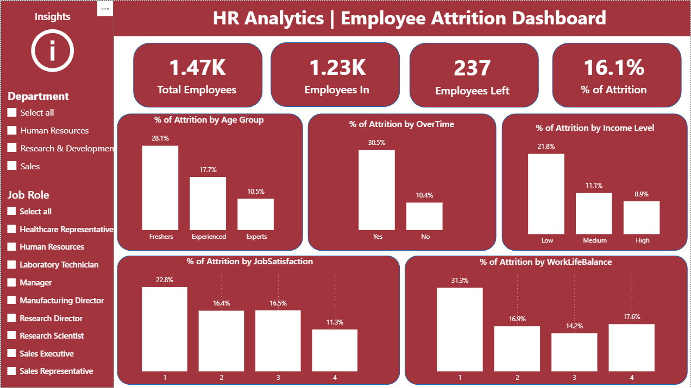
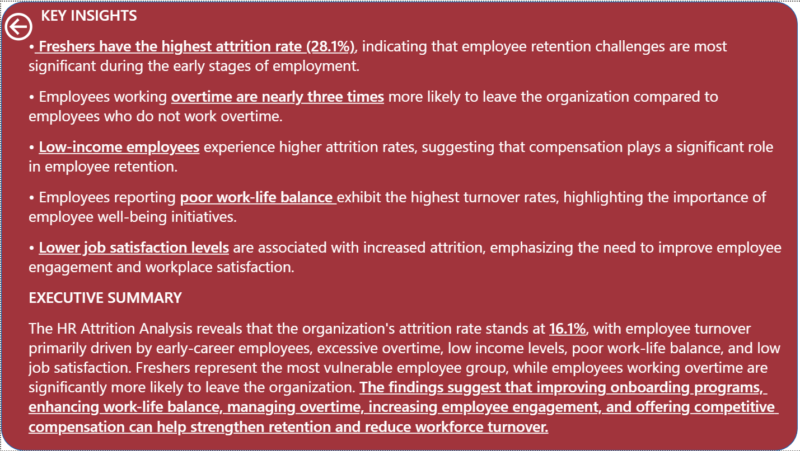
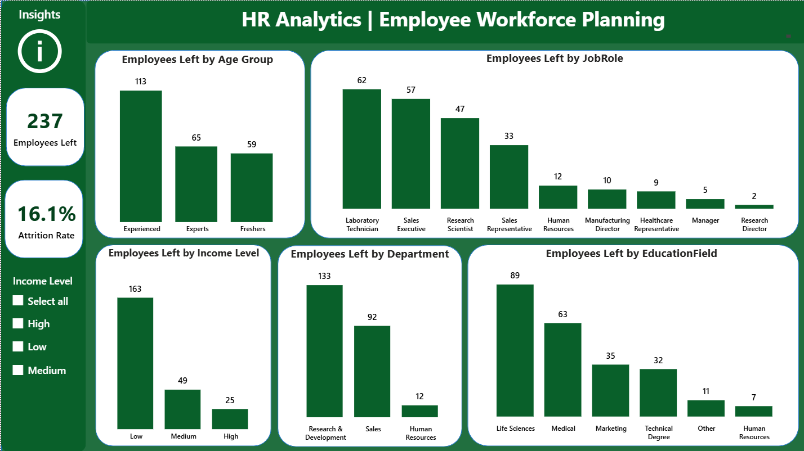
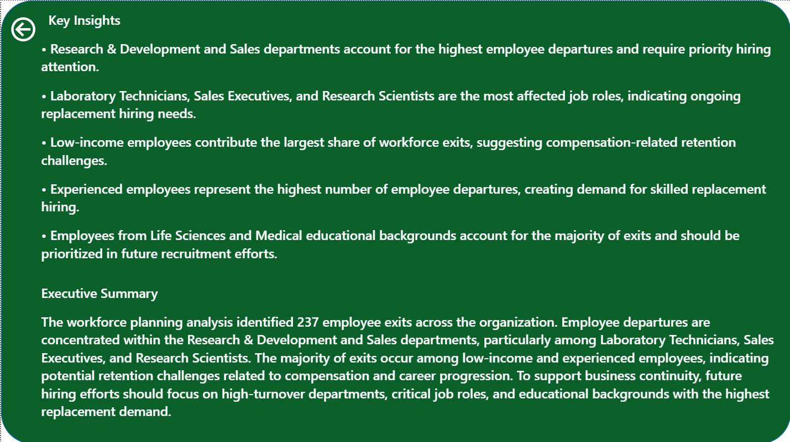

# 📊 HR Analytics Dashboard | Employee Attrition,Workforce Planning

## Project Overview

This project was developed using Power BI as part of the SkillCraft Technology Data Analytics Internship.

The project analyzed employee attrition patterns, workforce retention factors, and hiring requirements to support HR decision-making. Interactive dashboards were created to identify the key drivers of employee turnover and provide workforce planning recommendations based on historical employee exit trends.

---

## Business Problem

Employee attrition can significantly impact organizational productivity, employee morale, and recruitment costs. Understanding why employees leave and identifying future hiring requirements are essential for effective workforce management.

This project aimed to answer the following business questions:

* Why are employees leaving the organization?
* Which factors contribute most to employee attrition?
* Which departments and job roles require future hiring attention?
* How can workforce planning support business continuity?

---

## Project Objectives

* Analyzed employee turnover and attrition patterns.
* Evaluated employee satisfaction and workforce-related factors.
* Identified key drivers of employee attrition.
* Supported workforce planning and hiring decisions.
* Delivered interactive dashboards for HR decision-making.

---

# Dashboard Preview

## Employee Attrition Dashboard

## Attrition Insights & Executive Summary

## Employee Retention & Workforce Planning Dashboard

## Workforce Planning Insights & Executive Summary

---

# Dashboard 1: Employee Attrition Analysis

### KPIs

* Total Employees
* Employees Retained
* Employees Left
* Attrition Rate (%)

### Analysis Areas

* Attrition by Age Group
* Attrition by Income Level
* Attrition by Overtime
* Attrition by Job Satisfaction
* Attrition by Work-Life Balance

### Key Findings

* Freshers experienced the highest attrition rates among all age groups.
* Employees working overtime were significantly more likely to leave the organization.
* Low-income employees recorded higher attrition rates than medium- and high-income employees.
* Poor work-life balance was strongly associated with employee turnover.
* Lower job satisfaction levels contributed to increased attrition.

---

# Dashboard 2: Employee Workforce Planning

### KPIs

* Employees Left
* Attrition Rate (%)

### Analysis Areas

* Employees Left by Age Group
* Employees Left by Job Role
* Employees Left by Department
* Employees Left by Income Level
* Employees Left by Education Field

### Key Findings

* Research & Development and Sales departments accounted for the highest employee exits.
* Laboratory Technicians, Sales Executives, and Research Scientists showed the greatest replacement demand.
* Low-income employees contributed the largest share of workforce departures.
* Experienced employees represented the highest number of employee exits.
* Life Sciences and Medical educational backgrounds required focused recruitment efforts.

---

# Tools & Technologies

* Power BI
* Power Query
* DAX
* Data Modeling
* Data Visualization
* HR Analytics
* Workforce Planning

---

# DAX Concepts Applied

* CALCULATE()
* FILTER()
* COUNTROWS()
* DIVIDE()
* SWITCH()
* DISTINCTCOUNT()

---

# Business Impact

The project provided actionable insights into employee turnover patterns and workforce planning requirements. The analysis highlighted critical retention challenges and identified departments, job roles, and employee groups requiring priority hiring attention.

The findings can help organizations improve retention strategies, optimize workforce planning, and support data-driven HR decision-making.

---

# Skills Demonstrated

* Data Analysis
* HR Analytics
* Workforce Analytics
* Business Intelligence
* Data Visualization
* Dashboard Development
* DAX
* Data Modeling
* Problem Solving
* Insight Generation

---

# Conclusion

The analysis revealed that employee attrition was primarily influenced by overtime, compensation, work-life balance, job satisfaction, and early-career employment stages. Workforce planning analysis identified key hiring priorities within high-turnover departments and critical job roles, supporting more effective recruitment and retention strategies.

---

## Author

**Shaik Anas**

MBA (Business Analytics)
JNTU Kakinada School of Management Studies

### Internship

SkillCraft Technology – Data Analytics Internship
